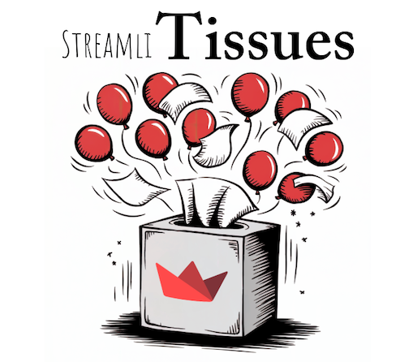

# StreamliTissues
Revolutionizing Streamlit Issue Discovery on GitHub with Snowflake Cortex LLM

## Problem Statement

The Streamlit GitHub repository, like many open-source projects, relies heavily on its Issues tab for tracking bugs, feature requests, and general feedback. However, its native search functionality has a major limitation: it only supports exact matches. This creates several challenges:

1. **Inaccessible Information:** Users may struggle to find existing issues if their search terms differ slightly (e.g., "data frame column freeze" versus "column pinning").
2. **Duplicate Issues:** Users often create new issues for problems that already exist but are phrased differently, leading to clutter and redundancy.
3. **Developer Burden:** Developers must manually link duplicate issues based on their familiarity with the repository, an inefficient and time-consuming process.
4. **Prioritization Challenges:** Identifying common issues described in varied language becomes more difficult, complicating efforts to group and prioritize fixes or new features.

## Solution: StreamliTissues

StreamliTissues uses Snowflake Cortex's Large Language Model (LLM) to dramatically improve the experience of discovering and managing GitHub issues. This app tackles the above challenges through a combination of advanced search, filtering, and contextual tools:

1. **Natural Language Search with RAG:** Users can enter conversational queries to find relevant issues without needing exact matches. The Retrieval-Augmented Generation (RAG) system ensures thorough and accurate results by blending Cortex's search capabilities with GitHub issue data.
2. **Advanced Sorting and Filtering:** The app provides powerful options to filter results by labels (e.g., feature, bug, enhancement), states (open, closed), and types (issue, pull request). Results can also be sorted by relevance, date, or reaction count, making it easy to locate specific issues, like open bugs or resolved feature enhancement PRs.
3. **Interactive Chat and Summarization:** Powered by Snowflake's Mistral-Large2 model, the app includes a smart chat assistant that allows users to interact with issues directly. Summarization features help group related issues, spot trends, and prioritize tasks effectively.

### How It Works

1. **Data Extraction and Processing:** GitHub issues data is scraped and processed using a custom ETL (Extract, Transform, Load) pipeline. The pipeline extracts issue details, categorizes them, and prepares the data for efficient retrieval and analysis and stores it in Snowflake to be ingested by ortex.
2. **Streamlit App Interface:** The Streamlit app serves as the UI frontend, allowing users to search for and interact with the processed data in an intuitive and efficient manner.
3. **Search:** Enter a natural language query, such as "How do I freeze columns in a data frame?"
4. **Retrieve and Rank:** The app uses Snowflake Cortex to pull and rank relevant GitHub issues.
5. **Filter and Sort:** Refine your search using filters for labels, states, types, and other criteria.
6. **AI Assistant:** Engage with a conversational assistant to gain further insights or identify potential solutions.

## Broader Applications

In the future, this system could be expanded to the Streamlit Forum, where it would enable users to:

- Quickly find answers to problems that have already been resolved.
- Minimize duplicate posts by improving search functionality.
- Enhance the overall user experience by making solutions more accessible.

Such an extension would further streamline the support ecosystem, reduce workload for moderators, and improve community engagement.

## Project Vision

StreamliTissues demonstrates how modern LLMs like Snowflake Cortex can address real-world challenges in open-source development. By enhancing issue discovery and management, it creates a more efficient and collaborative environment for both users and developers.

