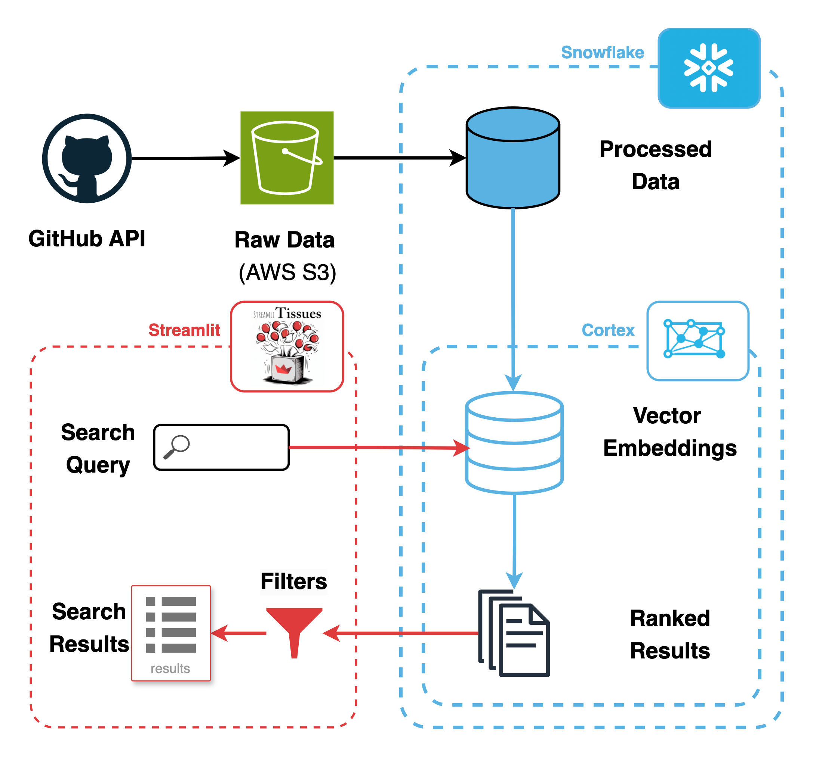

# StreamliTissues

A meta-app, built with Streamlit—supercharged with Snowflake AI—to help Streamlit evolve, one issue at a time.

> Wipe your Streamlit issues with StreamliTissues! —— My wife 

## Problem Statement

The [Streamlit GitHub repository](https://github.com/streamlit/streamlit), like many open-source projects, relies heavily on its [Issues](https://github.com/streamlit/streamlit/issues) tab for tracking bugs, feature requests, and general feedback. However, GitHub's native search functionality has a major limitation: it only supports *exact string matches*. This creates several challenges:

- 🔍🤷‍♂️ **Inaccessible Information:** Users may struggle to find existing issues if their search terms differ slightly (e.g., "dataframe column freeze" versus "column pinning").

- 🔄📋 **Duplicate Issues:** Users might create new issues for problems that already exist but are phrased differently, leading to clutter and redundancy for other users and developers.

- 💻😓 **Developer Burden:** Developers must manually link duplicate issues based on their familiarity with the repository and tribal knowledge, which is an inefficient and time-consuming process.

- 🧩📈 **Prioritization Challenges:** Identifying common issues described in varied language is challenging and complicates efforts for developers to group and prioritize fixes or new features.

## Solution: 🎈StreamliTissues🤧

StreamliTissues uses ❄️ [Snowflake Cortex](https://www.snowflake.com/en/data-cloud/cortex/)'s Large Language Model (LLM) to dramatically improve the experience of discovering and managing GitHub issues. The app tackles the above challenges through a combination of advanced search, dynamic filtering, and contextual tools:

- 🗣️🔍 **Natural Language Search with RAG:** Users can enter conversational queries to find relevant issues without needing exact matches. The Retrieval Augmented Generation (RAG) system ensures thorough and accurate results by leveraging Cortex's search capabilities on top of GitHub issue data.

- 🎛️🎚️ **Dynamic Sorting and Filtering:** The app provides options to filter results by labels (e.g., feature, bug, enhancement), types (issue, pull request), and states (open, closed). Results can also be sorted by relevance, date, or reaction count, making it easy to locate specific issues, like popular open bugs or recently resolved feature enhancement PRs.

- 🤖💬 **Interactive Chat and Summarization:** Powered by Snowflake's Mistral-Large2 model, the app includes a smart chat assistant that allows users to interact with issues directly. Summarization features help group related issues, spot trends, and prioritize tasks effectively. In future versions, the chat will help users resolve new issues by learning from the comments on the issue threads.

### How It Works

Here is a simplistic diagram of the app architecture:

1. **Data Extraction and Processing:** GitHub issues data is scraped and processed using a custom ETL (Extract, Transform, Load) pipeline. The pipeline extracts issue details, categorizes them, and prepares the data for efficient retrieval and analysis and stores it in Snowflake to be ingested by Cortex.

2. **Streamlit App Interface:** The Streamlit app serves as the UI frontend, allowing users to search for and interact with the processed issues data in an intuitive and efficient manner.

3. **Search:** User can enter a natural language query, such as "Why do I have to click submit form button twice for it to register?"

4. **Retrieve and Rank:** The app uses Snowflake Cortex to pull and rank the relevant GitHub issues.

5. **Filter and Sort:** User can refine their search results using filters for labels, states, types, and sort by various criteria such as relevance, date, or reaction count.

6. **AI Assistant:** User can optionally engage with a conversational assistant to gain further insights or identify potential solutions.

## Broader Applications

In the future, this system could be expanded to the [Streamlit Forum](https://discuss.streamlit.io/), where it would enable users to:

- Quickly find answers to problems that have already been resolved.
- Minimize duplicate posts by improving search functionality.
- Enhance the overall user experience by making solutions more accessible.

Such an extension would further streamline the support ecosystem, reduce workload for moderators, and improve community engagement.

## Project Vision

**StreamliTissues** shows how modern LLM ecosystems like Snowflake Cortex can tackle real-world challenges in open-source development. By improving how issues are discovered and managed, it creates a smoother and more collaborative experience for both users and developers.

RAG systems bring a lot to the table when it comes to information retrieval, but they also come with costs—refer to No Free Lunch Theorem for theoretical proof! Snowflake makes it easier to build these systems, but scaling them up requires carefully weighing the costs against the benefits. This proof of concept project is designed to give the Streamlit community and development team a chance to assess whether a system like this is worth the investment and can make a meaningful impact.

